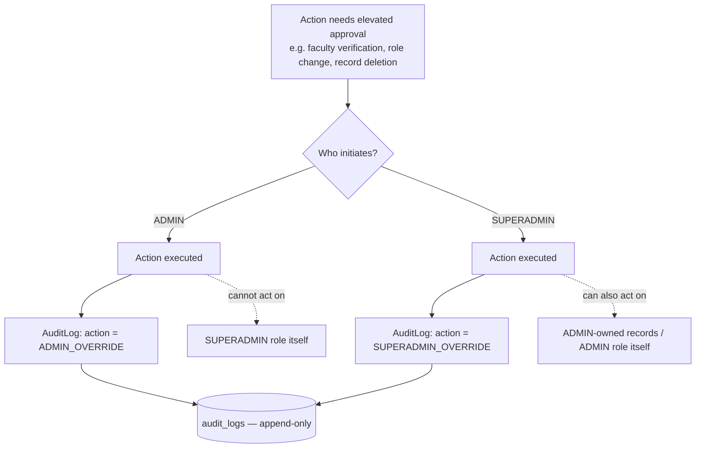
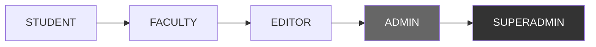
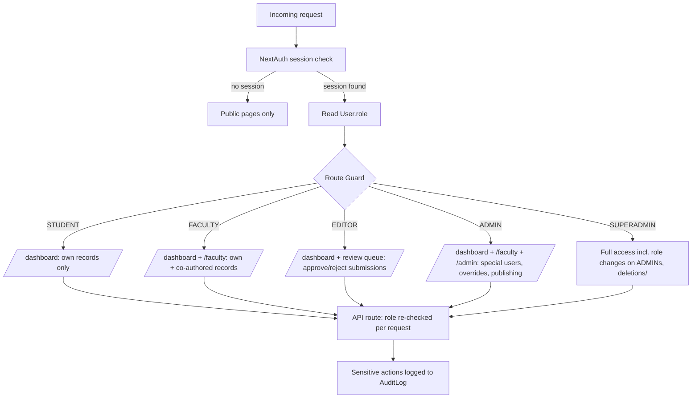
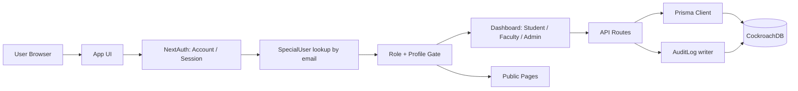
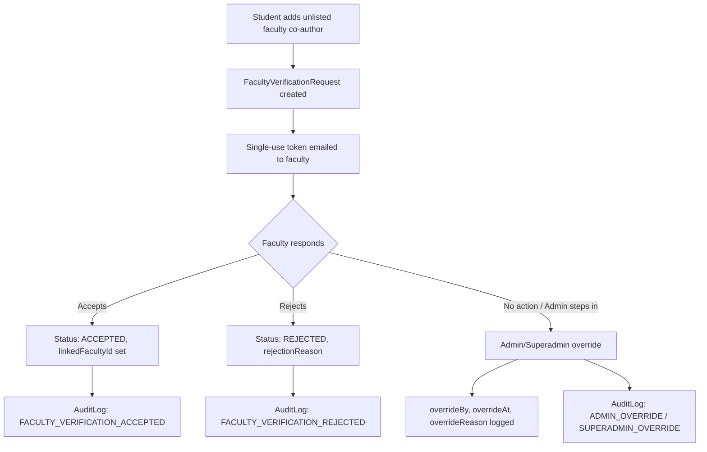
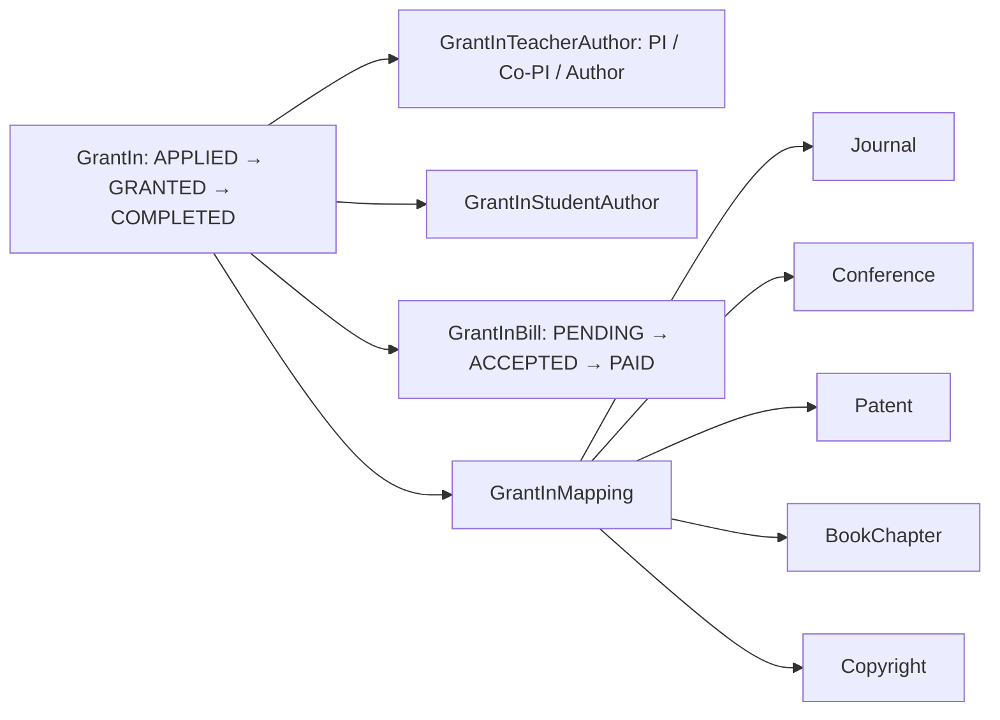
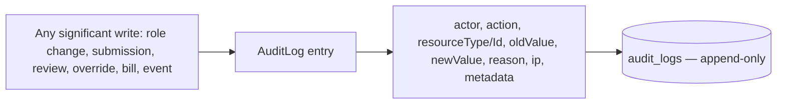
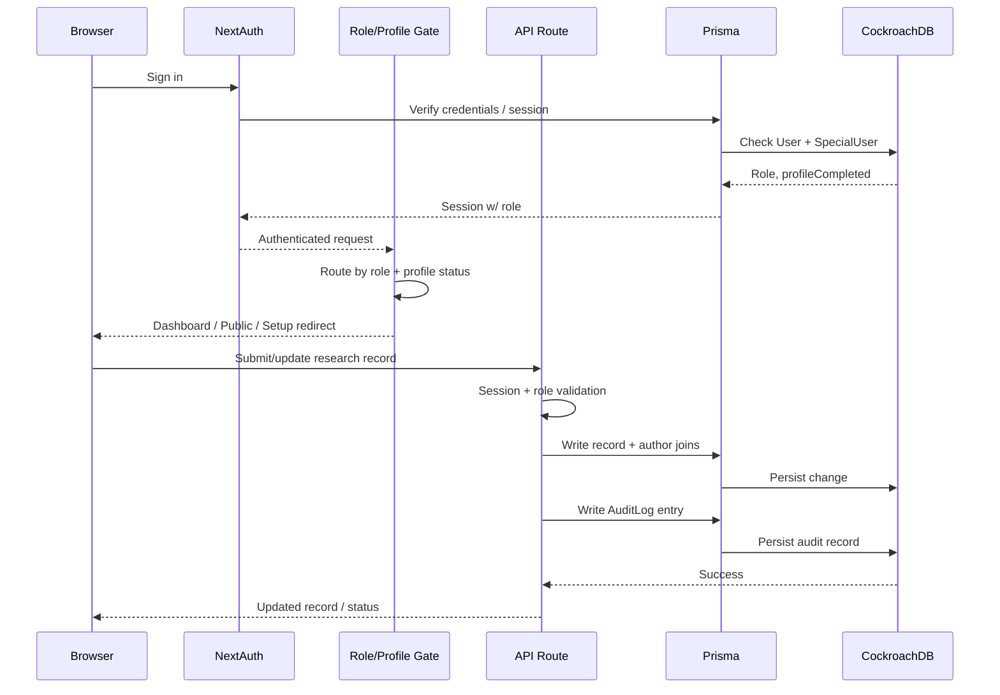

# System Overview & Architecture

## Project Overview

This is a role-based **Research & Institutional Management Portal**. It combines a public-facing site with an authenticated dashboard where students and faculty submit, track, and get approval on academic/research output — journals, conferences, patents, book chapters, copyrights, grants, certificates, FDPs, and achievements — while admins/editors manage users, verify faculty authorship, publish content, and audit every significant action.

## Tech Stack

- **Database:** CockroachDB (region: `aws-ap-south-1`)
- **ORM:** Prisma
- **Auth:** NextAuth (Account/Session/VerificationToken model shape)
- **IDs:** `cuid()` on every model

## User Roles

```
STUDENT < FACULTY < EDITOR < ADMIN < SUPERADMIN
```

- **STUDENT** (default) — submits and manages own research records
- **FACULTY** — same, plus appears as verifiable co-author on student work
- **EDITOR** — review/publish workflow on submitted research
- **ADMIN / SUPERADMIN** — user management, role overrides, full audit visibility

Roles can be **pre-assigned** via `SpecialUser` (email → role), so a user gets the correct role automatically on first login instead of defaulting to STUDENT.

## Admin vs Superadmin

The schema does **not** define a separate permissions table — `ADMIN` and `SUPERADMIN` are two values in the same `UserRole` enum, positioned as the top two tiers (`STUDENT < FACULTY < EDITOR < ADMIN < SUPERADMIN`). Their difference has to be read off two schema-level signals: the enum ordering itself, and the fact that `AuditAction` tracks `ADMIN_OVERRIDE` and `SUPERADMIN_OVERRIDE` as **distinct, separately-logged actions**.

### What's schema-verified vs assumed

| | Evidence in schema | Status |
|---|---|---|
| Both roles can override a `FacultyVerificationRequest` (`overrideBy` / `overrideAt` / `overrideReason`) | Field-level, generic — no role check encoded in the model | ✅ verified |
| Both roles are logged as distinct audit events | `AuditAction.ADMIN_OVERRIDE` vs `AuditAction.SUPERADMIN_OVERRIDE` | ✅ verified |
| `SUPERADMIN` ranks above `ADMIN` | Enum declaration order (`UserRole`) | ✅ verified (ordinal only — Prisma enums carry no numeric weight at the DB level, this is a convention your app code must enforce) |
| ADMIN manages `SpecialUser` records, publishes/rejects research, manages events | Implied by "Admin console" in project docs, not by any field restricting these mutations to `ADMIN` only | ⚠️ inferred, not enforced by schema |
| SUPERADMIN can change any user's role, including demoting another ADMIN | Implied by hierarchy convention (`USER_ROLE_CHANGED` audit action exists, but no field restricts *who* can trigger it) | ⚠️ inferred, not enforced by schema |
| Any hard-delete capability (`USER_DELETED` action exists) is SUPERADMIN-only | Reasonable convention given irreversibility, **not stated anywhere in the schema** | ⚠️ assumed |

**Data availability caveat:** the schema gives you an *identity* layer (who is ADMIN vs SUPERADMIN) and an *audit* layer (what got overridden and by whom), but authorization logic — which routes/actions each role may call — lives in application code (route guards / middleware), not in Prisma. If you want the real permission matrix, it needs to be pulled from your `proxy.ts` / API route guards, not the schema.

### Capability comparison (based on available signals)

| Capability | ADMIN | SUPERADMIN |
|---|---|---|
| Access `/dashboard`, `/faculty`, `/admin` | ✅ | ✅ |
| Manage `SpecialUser` (pre-assign roles) | ✅ (assumed) | ✅ |
| Override faculty verification | ✅ (`ADMIN_OVERRIDE`) | ✅ (`SUPERADMIN_OVERRIDE`) |
| Change another user's role | ⚠️ likely capped below ADMIN/SUPERADMIN | ✅ full range, incl. promoting/demoting ADMINs |
| Trigger `USER_DELETED` | ⚠️ unconfirmed | ✅ assumed sole owner |
| Appears as highest audit-trust actor | No | Yes — separate `SUPERADMIN_OVERRIDE` action exists specifically to distinguish this tier in logs |

### Escalation / override flow



### Role hierarchy at a glance



## Role-Based Access Control (RBAC)

Access control is **route/middleware-enforced**, not schema-enforced — Prisma only stores the `role` value on `User`; the gate that decides what a role may reach lives in the app's proxy/route-guard layer. Documented route rules (`/dashboard`, `/faculty`, `/admin`) only distinguish STUDENT / FACULTY / ADMIN; EDITOR and SUPERADMIN's exact route boundaries aren't independently documented, so those cells below are marked as inferred from the role hierarchy rather than confirmed.

### Access matrix

| Area / Action | STUDENT | FACULTY | EDITOR | ADMIN | SUPERADMIN |
|---|:---:|:---:|:---:|:---:|:---:|
| Public pages / public journal feed | ✅ | ✅ | ✅ | ✅ | ✅ |
| `/dashboard` (own research records) | ✅ | ✅ | ✅ (assumed) | ✅ | ✅ |
| `/faculty` (faculty-level views) | ❌ | ✅ | ⚠️ inferred | ✅ | ✅ |
| Review/approve submitted research | ❌ | ❌ | ✅ (assumed role purpose) | ✅ | ✅ |
| `/admin` (special-user management) | ❌ | ❌ | ❌ | ✅ | ✅ |
| Override faculty verification | ❌ | ❌ | ❌ | ✅ (`ADMIN_OVERRIDE`) | ✅ (`SUPERADMIN_OVERRIDE`) |
| Manage `SpecialUser` (pre-assign roles) | ❌ | ❌ | ❌ | ✅ (assumed) | ✅ |
| Change another user's role | ❌ | ❌ | ❌ | ⚠️ capped, inferred | ✅ full range |
| Delete a user (`USER_DELETED`) | ❌ | ❌ | ❌ | ⚠️ unconfirmed | ✅ assumed |
| View full `AuditLog` | ❌ | ❌ | ❌ | ✅ (assumed) | ✅ |

✅ = confirmed by docs/schema · ⚠️ = inferred from role ordering, not explicitly documented · ❌ = no evidence of access

### Access flow diagram



### Text summary

- **STUDENT** — sandboxed to their own dashboard and their own research records as an author; no review or admin surface.
- **FACULTY** — same dashboard access, plus `/faculty`-tier views and appears as a verifiable co-author across student submissions.
- **EDITOR** — sits above FACULTY in the enum; its purpose (per role name) is reviewing/approving submitted research, though the schema has no field that restricts `teacherStatus`/status transitions to EDITOR specifically — this is enforced in application logic, not in Prisma.
- **ADMIN** — reaches `/admin`, manages `SpecialUser` pre-assignments, can override faculty verification (logged as `ADMIN_OVERRIDE`), and likely handles day-to-day publishing/moderation.
- **SUPERADMIN** — same admin surface plus the actions reserved for the top of the hierarchy: changing an ADMIN's own role, deleting users, and any override that needs to be distinguishable in the audit trail as `SUPERADMIN_OVERRIDE` rather than `ADMIN_OVERRIDE`.

Every role transition and override is written to `AuditLog` regardless of tier, so even where the *permission boundary* isn't visible in the schema, the *consequence* of crossing it always is.

## High-Level Architecture



## Core Data Model

### Identity & Access

| Model | Purpose |
|---|---|
| `User` | Central profile — role, degree, department, skills, links, research relations |
| `Account` / `Session` | NextAuth OAuth + session storage |
| `VerificationToken` / `PasswordResetToken` | Email verification & password reset flows |
| `SpecialUser` | Pre-registers an email with a role (e.g. auto-FACULTY on signup) |
| `Notification` | Per-user in-app notifications with read state |

### Research Output Modules

Each of these follows the **same student/faculty co-authorship pattern**:

| Module | Status Enum | Notes |
|---|---|---|
| `Journal` | `JournalStatus` | scope, review type, access type, indexing, quartile, impact factor |
| `Conference` | `ConferenceStatus` | mode (online/offline/hybrid), presentation/publication dates |
| `Patent` | `PatentStatus` | filing → grant lifecycle, grantedPatentNo |
| `BookChapter` | `BookchapterStatus` | ISBN/ISSN, publisher, DOI |
| `Copyright` | `CopyrightStatus` | registration number, filing/grant dates |
| `Certificate` | `CertificateStatus` | offeredBy, completion date |
| `FDP` | `FDPStatus` | faculty development program record |
| `Achievement` | `AchievementStatus` | category, year |

Each publication-type module (Journal, Conference, Patent, BookChapter, Copyright) has:

- **`<Model>StudentAuthor`** — direct join to `User` (student)
- **`<Model>TeacherAuthor`** — join to `User` (nullable — faculty may be unlisted), plus `FacultyVerificationStatus` and a link to a `FacultyVerificationRequest`
- **`teacherStatus`** (`TeacherStatus`) — independent internal review track (UPLOADED → ACCEPTED → PUBLISHED / UPDATE / REJECTED)
- **`isPublic`** flag — gates visibility on the public journal/research feed

### Faculty Verification



### Grants & Bills



`GrantInMapping` links a grant to whichever publication it funded (`publicationType` discriminates which FK is populated). `GrantInBill` tracks reimbursement/expense documents (registration, travel, accommodation, hardware, subscription) with an approval + payment status.

### Public Website

`Event` (DRAFT → PUBLISHED → CANCELLED/ARCHIVED) powers public event listings. Any record with `isPublic = true` and a published status surfaces on the public research/journal feed — no auth required to view.

### Audit Trail



`AuditLog` is append-only by design (normal users cannot modify/delete). `AuditAction` enumerates every tracked event: auth, research lifecycle, grants, bills, achievements, events, faculty verification, and admin overrides.

## Request Lifecycle



## Enum Summary

- **Lifecycle statuses** (per module): `SUBMITTED → UNDER_REVIEW → APPROVED → PUBLISHED` (pattern repeats with module-specific extra states: `PRESENTED` for conferences, `GRANTED` for patents/grants)
- **`TeacherStatus`**: `UPLOADED → ACCEPTED → PUBLISHED`, with `UPDATE` / `REJECTED` branches
- **`FacultyVerificationStatus`**: `PENDING / ACCEPTED / REJECTED`
- **`UserRole`**: `STUDENT / FACULTY / EDITOR / ADMIN / SUPERADMIN`
- **`BillStatus`**: `PENDING / ACCEPTED / REJECTED / PAID`
- **`EventStatus`**: `DRAFT / PUBLISHED / CANCELLED / ARCHIVED`

## Summary

The schema is built around one repeating pattern — **record + student authors + faculty authors (with verification) + status + isPublic flag** — applied consistently across seven research/output types, layered with a grants/billing subsystem, a faculty-verification workflow, role pre-assignment via `SpecialUser`, and an append-only `AuditLog` covering every meaningful state change in the system.