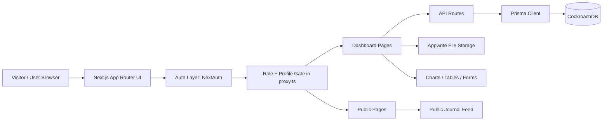
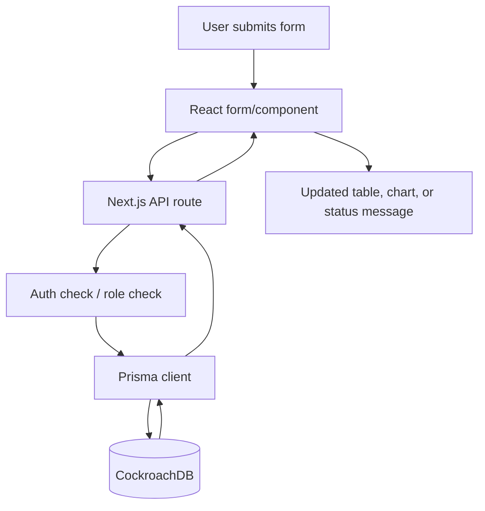
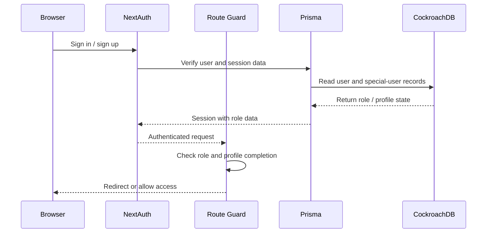
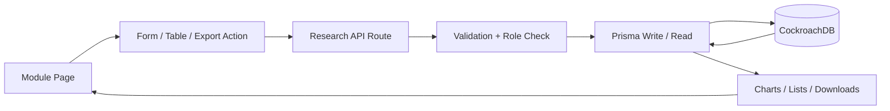
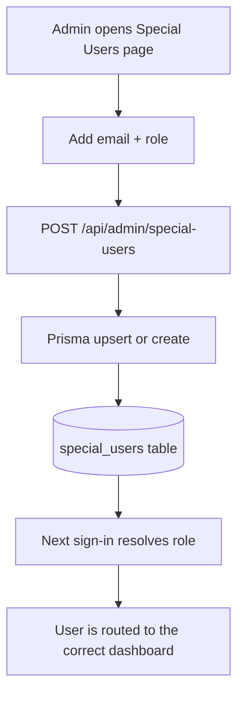

# Project Overview

This website is a role-based research and administration portal for an Innovation and Entrepreneurship Development Cell (IEDC). It combines a public-facing institutional website with a secure internal dashboard for students, faculty, and administrators to manage research outputs, approvals, and special-user access.

## What The Website Does

The platform is organized around three main experiences:

1. Public website for visitors to learn about the institution, explore the landing page, and view public journal content.
2. Authenticated dashboard for students and faculty to manage research-related records such as journals, conferences, patents, book chapters, certificates, FDPs, copyright, and grants.
3. Admin console for managing special users and assigning elevated access before or after signup.

## User Roles

- Student: can access the student dashboard and create or manage their own academic/research records.
- Faculty: can access faculty-level dashboard areas and research management flows.
- Admin: has full access, including the special-user management screen.

The system also supports a special-user mapping table, which pre-assigns roles based on email address. This is useful when the organization wants a user to receive a specific role as soon as they sign in.

## Main Modules

- Authentication and account creation
- Profile completion onboarding
- Dashboard and sidebar navigation
- Research record management
- Grant and bill tracking
- Admin special-user management
- Public journal viewing

## High-Level Architecture

## Working Flow

### 1. First Visit

The homepage presents the institution brand, overview sections, achievements, visuals, and footer content. A visitor can browse public information without authentication.

### 2. Sign In or Sign Up

Users authenticate through the auth pages. The auth layer verifies credentials, checks email verification, and loads the user session.

### 3. Role Resolution

After authentication, the system checks the `SpecialUser` table using the user email.

- If an entry exists, the role from `SpecialUser` is applied.
- If no entry exists, the user defaults to `STUDENT`.

### 4. Profile Completion

If the user profile is not yet completed, the routing layer redirects the user to the setup profile page. This page collects profile details and can upload the profile image to Appwrite.

### 5. Protected Routing

The proxy layer enforces access rules:

- `/dashboard` for STUDENT, FACULTY, and ADMIN
- `/faculty` for FACULTY and ADMIN
- `/admin` for ADMIN only

### 6. Dashboard Usage

The dashboard exposes forms, tables, export actions, and stats for the academic/research modules. These pages call API routes, which use Prisma to read and write the database.

### 7. Admin Management

Admins can add, edit, list, or delete special users. This is the control point for assigning future users their intended role.

## Data Flow

## Authentication And Role Flow

## Research And Record Management Flow

Each research module follows the same pattern:

1. User opens a module such as journal, conference, patent, book chapter, certificate, FDP, copyright, or grant.
2. The page loads data from a dedicated API route.
3. The user creates, edits, exports, or deletes records through a form or table.
4. The API validates the session and role.
5. Prisma writes the change to CockroachDB.
6. The UI refreshes statistics, lists, and charts after the update.

## Special-User Management Flow

The special-user system is the main way administrators pre-assign roles.

## Public Website Flow

- The landing page introduces the institution and the IEDC identity.
- Public pages are separated from authenticated dashboard content.
- Public journal content is available without requiring a login.
- The public layout stays lightweight and focused on content display.

## Internal Dashboard Areas

- Home dashboard summary cards
- Book chapters
- Certificates
- Conferences
- Copyright entries
- FDP records
- Grant-in records and bill uploads
- Journal management
- Patent records
- Admin special-user management

## Supporting Services

- Prisma ORM for database access
- CockroachDB for persistent storage
- NextAuth for authentication and session handling
- Appwrite for file upload support in profile setup
- Redis-backed utilities for cache or rate-limit style support where used

## Default Seeded Special User

The project includes a Prisma seed that creates or updates the following special user:

- Email: velocium.iot@gmail.com
- Role: FACULTY

This ensures the account is recognized as faculty during login even before any manual admin update.

## Client Summary

This website is not only a content site. It is a complete institutional workflow system for login, role assignment, onboarding, and academic record management. The client can use it to manage users, control access, track research outputs, and present a professional public-facing institutional brand from the same application.